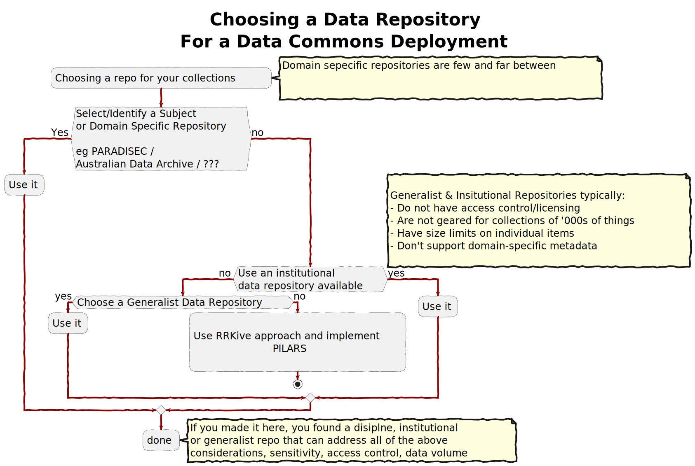

## Origins -- why create PILARS?

[PILARS] is an evolution of of the [Arkisto website](https://arkisto-platform.github.io/). This was created at the University of Technology Sydney with a small group of partners, and served to bring together a community of like-minded developers implementing [CARE and FAIR] repositories.

The Arkisto work was helpful in that it aided in securing funding and was the starting point for principled development of Archival Repository solutions at LDaCA to give interoperability with PARADISEC. However it had a few issues. The basis of Arkisto was in a set of principles: 

1.  But we also presented it as a “Platform”
1.  And tied implementation to two particular Specifications (which we still use at LDaCA) 
1.  Critically, the site did not have clear ownership or governance so there was no mechanism for resolving disagreements or making major changes to the site

So, we started the [PILARS] work to specify some protocols for implementing [CARE and FAIR] complianet Archival Repositories.

## The need for PILARS

As with Arkisto, the driver for creating [PILARS] was gap in the infrastructure available to communities trying to implement Data Commons or establish archival repositories; in many cases there were no obvious existing placecs to host data, and many of the technical solutions available are not fit for purpose for presenting collections of data in a usable way, with low cost and low risk.

The following flow-chart illustrates the issue. In choosing a repository service for data, institutional data repositories (where they exist) are typically geared to deal with discrete data packages, not 1000s of images or recordings or samples that researchers might want to access individually, or in filtered sets and are usually geared for open access only. 

The tools we are developing at LDaCA, with our partners are designed to offer solutions to any data-archive project where there are no existing services, and no institutional resources on hand (such as a special collections unit in a library). 

Read more about [adopting RRKive software solutions to make PILARS compliant Archival Repositories](/adoption)
