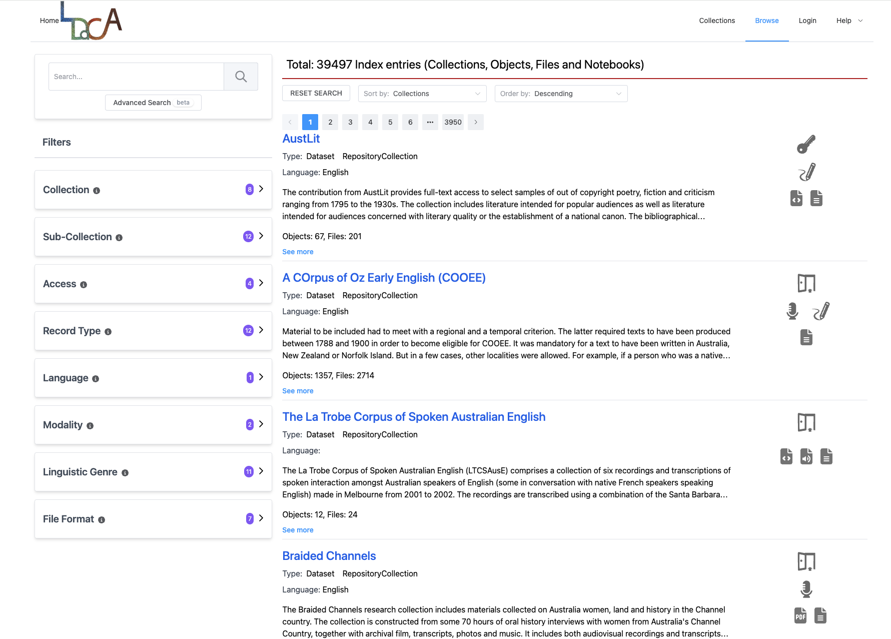
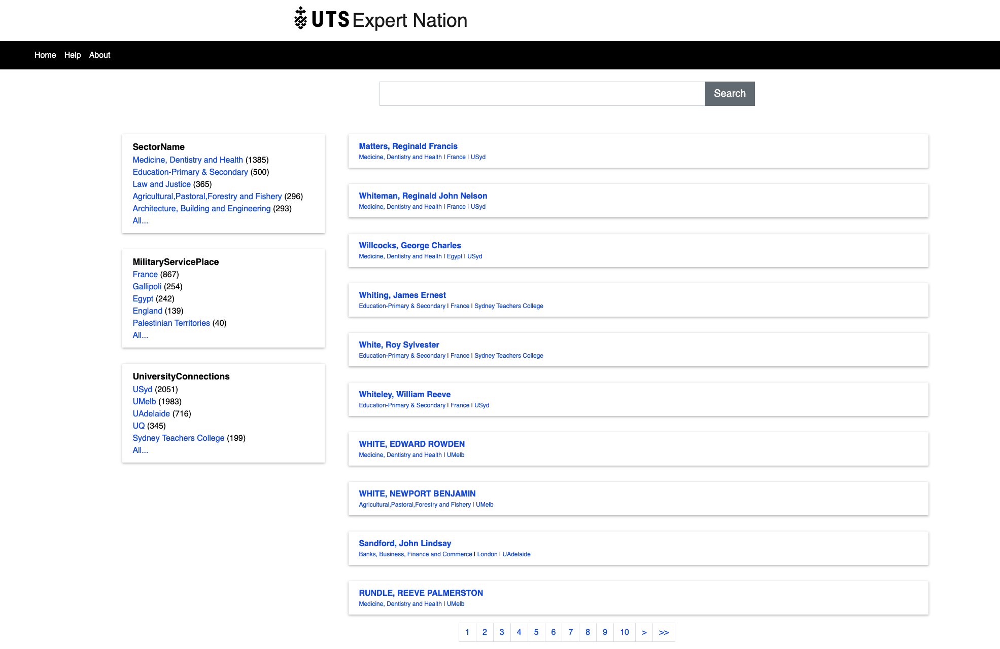

(This page is a work in progress, first version is a quick update from the Arkisto website: will be updated with fresh examples in Q2 2024)

There are multiple use cases for RRKive which we will document in the abstract, in addition to the specific [case studies](/case-studies/) we're already working on. Due to its standards-based and extensible nature, RRKive can realise the goal of making data [FAIR](https://www.force11.org/group/fairgroup/fairprinciples) (Findable, Accessible, Interoperable, Re-usable).

# The (mythical) minimal RRKive platform

The simplest possible RRKive platform deployment would be a repository with some
objects in it. No portal, no data ingest or preservation service, eg:

That might not seem very useful in itself but a standards-based repository is a
great candidate for data preservation - it puts the _I_ in FAIR (Interoperable)
data. It can also provide a basis for re-activation via services that can Reuse
the data by making Findable and Accessible. Because of RRKive's use of
Standards, the repository is the core to which services can be added.

# Adding a web portal

To make the data Findable - the F in FAIR Data a portal may be added - this
requires some configuration but significantly _less_ than building a service
from scratch.

For example the [Oni](https://github.com/Language-Research-Technology/oni-ui)
toolkit is used by the Language Data Commons of Australia for its portals, the
main one being <https://data.ldaca.edu.au/search> 

The same portal software has been used in other contexts and is being adapted at
the University of Sydney for a variety of data collections. 

Web portals depend on the repository content being *indexed* - web pages are
generated mostly from calls to the index, and thus can be highly performant.
There is more on indexing below.

# Data ingest pathways

But how does data get into an OCFL repository? There are several patterns in production, in development and planned.

## A snapshot repository

Exporting a repository to RO-Crate can be a matter of writing a script to
interrogate a database, convert static files, or otherwise traverse an existing
dataset.

This pattern was used by
[the 2020 snapshot of ExpertNation](https://expertnation.research.uts.edu.au/) -
where we were given an XML file exported from the Heurist Content Management System and used a script to
convert that data to the RO-Crate format. This RO-Crate can in turn be deposited
in a repository - in this case the
[UTS data repository](/case-studies/uts-repo) - and
[served via a portal](#adding-a-web-portal), preserving the data while at the
same time making it Accessible.

This pattern has also been used extensively in the Language Data Commons of Australia where individual collections of data are converted using a series of scripts - instead of creating an entire site from one collection as in Expert Nation, each collection is loaded into the site.

<!----

## A growing cultural collection

In [PARADISEC](/case-studies/paradisec/), research teams add collections and items using bespoke tools that were written for the archive.

-->

## Field data capture

Data from sensors in the field is often streamed directly to some kind of database with or without portal services and interfaces. There are multiple possible RRKive deployment patterns in this situation. Where practical, the UTS eResearch team aimed to take an approach that first keeps copies of any raw data files and preserves those. The team then built databases and discovery portals from the raw data, although this is not always possible.

This diagram shows an approximation of one current scenario which was implemented at UTS where raw files were NOT available, but readings could be extracted from a Database:

## Analytical and housekeeping tools

So far on this page we have covered simplified views of RRKive deployment patterns with the repository at the centre, adding discovery portals and giving examples of data-acquisition pipelines (just scratching the surface of the possibilities). These things in themselves have value: making sure data is well described and as future proof as possible are vitally important but what can we DO with data?

### OCFL + RO-Crate tools

Having data in a standard-stack, with OCFL used to lay-out research data objects and RO-Crate to describe them, means that it is possible to write simple programs that can interrogate a repository. That is, you don't have to spend time understanding the organisation of each dataset. The same idea underpins RRKive's web-portal tools: standardization reduces the cost of building.

-   <b>Validators and preservation tools</b>: there are not many of these around yet, but members of the RRKive community as well as the broader OCFL and RO-Crate communities are working on these; expect to see preservation tools that work over OCFL repositories in particular.

-   <b>Brute-force scripts</b>: for moderate-sized repositories, it is possible to write a scripts to examine every object in a repository and to run analytics. For instance, it would be possible to visualise a number of years' worth of sensor readings from a small number of sensors or to look for the geographical distribution of events in historical datasets.

### Adding databases and other indexes

For larger-scale use, visiting every object in a repository can be inefficient. In these cases, using an index means that an analysis script can request all the data in a particular time-window or of a certain type - or any other query that the index supports. 

While the index engines used in our current portals are based on full-text search and metadata, we expect others to be built as needed by disciplines using, for example, SQL databases or triple stores.

### Analysis tool integration

Above, we have looked at how people or machines can access an RRKive platform deployment by querying the repository, either directly or via an index. However, there is a much larger opportunity in being able to integrate RRKive deployments with other tools in the research landscape. To take one example, text analysis is in great demand across a very wide range of disciplines. This _hypothetical_ scenario shows the potential for a researcher to use a web portal to locate datasets which contain text and then send the whole results set to a an analysis platform, in this case an interactive Jupyter notebook.

RRKive already allows re-use of visualisation tools and viewers that can be embedded directly in a portal. We are planning a "widget store" that will enable researchers to choose and deploy a number of add-ons to the basic portal.

# Institutional and discipline repositories

One of the major use case deployment patterns for RRKive is to underpin an
institutional data repository / archive function, see the
[UTS data repository](/case-studies/uts-repo/) for an established example.

In this use case, data is ingested into the repository via a research data
management system which talks to the OCFL repository, _not_ the portal. There
is a clear separation of concerns: the portal's job is to provide controlled
access and search services via an index, the OCFL repository keeps version
controlled data on disc, and the Research Data Management System handles deposit
of data.

## Manual archiving

At UTS the Research Data Management system in use is
[RedBox](https://www.redboxresearchdata.com.au/) - an
open source platform for managing data
across the research process from research data management planning (via Research
Data Management Plans (RDMPS)) to archiving and re-use of data. ReDBox has
services for provisioning and/or tracking _Research Workspaces_, which are sites
where research data collection and management. All of the data acquisition
scenarios described above would qualify as Research Workspaces, as do
file-shares on institutional storage or share-sync services such as CloudStor,
as well as survey platforms, project management and version control systems such
as Gitlab and Github.

<!--
## Fetching data from Research Workspaces

UTS researchers will be able to use the Research Data Management System to select a workspace for archiving, add metadata as appropriate, and the system will deposit the data for them.

-->

## Publishing data

The UTS institutional data repository actually has two parts: an internal behind-the-firewall archive, with access control - to ensure that only authorized people can access data - and an external data portal for publicly accessible data. This architecture reduces the risk of data breaches by not allowing access through the firewall to sensitive or confidential data until secure tools are available to allow extra-institutional access.

Researchers can select a subset of an archived dataset to be published, or publish an entire dataset.

A "bot" "notices" that a new public dataset is available and copies it to the public repository, where it will be indexed and made available through the data portal.

NOTE: There is no monolithic "Repository Application" that mediates all interactions with the file-base OCFL store but a set of services which operate independently. This does mean that processes must be in place to ensure that there is not file-contention, with two bits of software trying to update an object at the same time.
