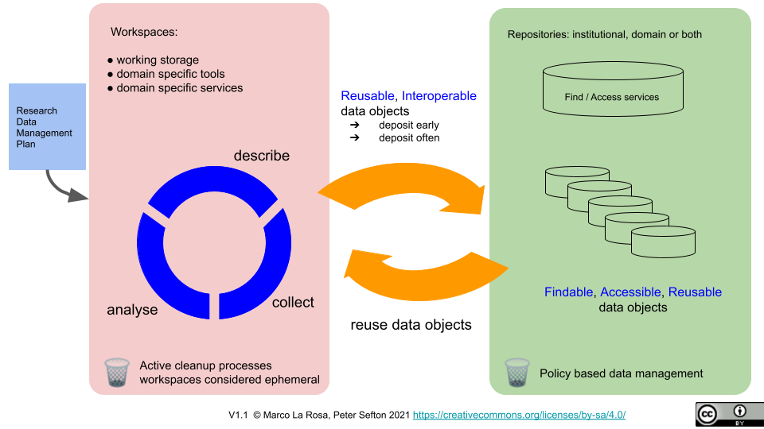

# FAIR & CARE

The [FAIR](https://www.nature.com/articles/sdata201618) and/or [CARE](https://static1.squarespace.com/static/5d3799de845604000199cd24/t/6397b363b502ff481fce6baf/1670886246948/CARE%2BPrinciples_One%2BPagers%2BFINAL_Oct_17_2019.pdf) principles are frequently mandated in various contexts around the world, inclduing for outputs of the Australian Research Data Commons (ARDC).

These principles are not a DIY manual that can be simply adopted by researchers - to implement a system that supports CARE and FAIR research requires development of infrastructure and a governance frameworks. The RRKive principles and website are aimed at those undertaking these substantials tasks.

# Care Principles - Collective Benefit

Data ecosystems shall be designed and function in ways that enable Indigenous Peoples to derive benefit from the data.

-  C1: 	For inclusive development and innovation 

   Governments and institutions must actively support the use and reuse of data by Indigenous nations and communities by facilitating the establishment of the foundations for Indigenous innovation, value generation, and the promotion of local self-determined development processes.

-  C2: 	For improved governance and citizen engagement 

    Data enrich the planning, implementation, and evaluation processes that support the service and policy needs of Indigenous communities. Data also enable better engagement between citizens, institutions, and governments to improve decision-making. 

    Ethical use of open data has the capacity to improve transparency and decision-making by providing Indigenous nations and communities with a better understanding of their peoples, territories, and resources. It similarly can provide greater insight into third-party policies and programs affecting Indigenous Peoples. 

- C3: 	For equitable outcomes 

   Indigenous data are grounded in community values, which extend to society at large. Any value created from Indigenous data should benefit Indigenous communities in an equitable manner and contribute to Indigenous aspirations for wellbeing.

# Care Principles - Authority to Control 

Indigenous Peoples’ rights and interests in Indigenous data must be recognised and their authority to control such data be empowered. Indigenous data governance enables Indigenous Peoples and governing bodies to determine how Indigenous Peoples, as well as Indigenous lands, territories, resources, knowledges and geographical indicators, are represented and identified within data. 

-  A1 	Recognizing rights and interests
	
   Indigenous Peoples have rights and interests in both Indigenous Knowledge and Indigenous data. Indigenous Peoples have collective and individual rights to free, prior, and informed consent in the collection and use of such data, including the development of data policies and protocols for collection.
 
-  A2: 	Data for governance Indigenous 

   Peoples have the right to data that are relevant to their world views and empower self-determination and effective self-governance. Indigenous data must be made available and accessible to Indigenous nations and communities in order to support Indigenous governance. 

-  A3: 	Governance of data 

   Indigenous Peoples have the right to develop cultural governance protocols for Indigenous data and be active leaders in the stewardship of, and access to, Indigenous data especially in the context of Indigenous Knowledge.

# Care Principles - Responsibility 

Those working with Indigenous data have a responsibility to share how those data are used to support Indigenous Peoples’ selfdetermination and collective benefit. Accountability requires meaningful and openly available evidence of these efforts and the benefits accruing to Indigenous Peoples. 

- R1: 	For positive relationships
	
  Indigenous data use is unviable unless linked to relationships built on respect, reciprocity, trust, and mutual understanding, as defined by the Indigenous Peoples to whom those data relate. Those working with Indigenous data are responsible for ensuring that the creation, interpretation, and use of those data uphold, or are respectful of, the dignity of Indigenous nations and communities. 

- R2: 	For expanding capability and capacity 

   Use of Indigenous data invokes a reciprocal responsibility to enhance data literacy within Indigenous communities and to support the development of an Indigenous data workforce and digital infrastructure to enable the creation, collection, management, security, governance, and application of data. 

- R3: 	For Indigenous languages and worldviews

   Resources must be provided to generate data grounded in the languages, worldviews, and lived experiences (including values and principles) of Indigenous Peoples.

#  Care Principles - Ethics

Indigenous Peoples’ rights and wellbeing should be the primary concern at all stages of the data life cycle and across the data ecosystem. 
-  E1: 	For minimizing harm and maximizing benefit 

   Ethical data are data that do not stigmatize or portray Indigenous Peoples, cultures, or knowledges in terms of deficit. Ethical data are collected and used in ways that align with Indigenous ethical frameworks and with rights affirmed in UNDRIP. Assessing ethical benefits and harms should be done from the perspective of the Indigenous Peoples, nations, or communities to whom the data relate. 

-  E2: 	For justice 

   Ethical processes address imbalances in power, resources, and how these affect the expression of Indigenous rights and human rights. Ethical processes must include representation from relevant Indigenous communities. 

-  E3: 	For future use

   Data governance should take into account the potential future use and future harm based on ethical frameworks grounded in the values and principles of the relevant Indigenous community. Metadata should acknowledge the provenance and purpose and any limitations or obligations in secondary use inclusive of issues of consent.

# FAIR Principles - F

To be Findable:

- F1. (meta)data are assigned a globally unique and *persistent* identifier

- F2. data are described with rich metadata (defined by R1 below)

- F3. metadata clearly and explicitly include the identifier of the data it describes

- F4. (meta)data are registered or indexed in a searchable resource

::: notes

It's easy to say the meta(data) should be assigned PIDs (Persistent IDs) but there are a lot of requirements that follow from this. Peersistent identifiers require persistent storage of the (meta)data, governance 

:::

# FAIR Principles - A

To be Accessible:

- A1. (meta)data are retrievable by their identifier using a standardized communications protocol

  - A1.1 the protocol is open, free, and universally implementable

  - A1.2 the protocol allows for *an authentication and authorization procedure, where necessary*

- A2. metadata are accessible, even when the data are no longer available

::: notes

If we're going to observe the CARE principles then *an authentication and authorization procedure* is DEFINITELY needed -- but this is not a trivial undertaking, particularly in observing the *standardized communications protocol* 

:::

# FAIR Principles - I

To be Interoperable:

- I1. (meta)data use a formal, accessible, shared, and broadly applicable language for knowledge representation.

- I2. (meta)data use vocabularies that follow FAIR principles

- I3. (meta)data include qualified references to other (meta)data

::: notes

Progress has been made on this on in the 

:::

# FAIR Principles - R

To be Reusable:

- R1. meta(data) are richly described with a plurality of accurate and relevant attributes

  - R1.1. (meta)data are released with a clear and accessible data usage license

  - R1.2. (meta)data are associated with detailed provenance

- R1.3. (meta)data meet domain-relevant community standards

# 

::: notes
There is a fundamental distinction between repositories and workspaces and the role they play in a FAIR-compliant research workflow

:::

# Examples of Workspaces

Generic workspace examples include:

- Survey tools (Survey Monkey, ReDCAP)
- Electronic Lab Notebooks
- Code environments (Jupyter notebooks, Binderhub, Github*, Matlab, R Studio)
- Research & Analytical Databases**
- "R: Drive" or similar storage
- Cloud storage such as Dropbox, Google Drive or OneDrive

*Yes, git uses "repositories" but these do _not_ function as archives -- don't assume Microsoft, the current owner of github, will preserve research or other code

**No a database is not necessarily a _repository_ (more on that below)

# Features of a repository

<table>
<thead>
<tr>
<th> ⬇️ Governance / Policy ⬇️</th>
<th> ⬇️ Technology ⬇️</th>
</tr>
</thead>
<tbody>
<tr>
<td>

-  Purpose / mission

-  Data retention policies 

-  Planning:

   -  ongoing stewardship & contingencies 

   -  persistence of IDs 

   - data exit

   - software obsolescence

-  Deposit and use and redistribution licensing/permissions framework

</td>
<td>

-  Tested data-exit pathway*

-  Interoperable metadata framework

-  APIs

-  Implementation of ID resolution & updating

-  Discovery services / catalogues / indicies

   -  Collection / archival structures

   -  Full-text & semantic indexing

   -  Facets for discovery based on explicit and implicit metadata

-  Sustainable technology neutral access-control mechanisms

*Get this right and the other things follow

</td>
</tr>
<tr>
<th>⬆️ Repo as Institution ⬆️</th>
<th>⬆️ Repo Implementation ⬆️</th>
</tr>
</tbody>
</table>

::: notes

A repository is as much an _institution_ as it is a software  _implementation_.

:::

# CARE / FAIR 

<table>
<thead>
<tr>
<th> ⬇️ Governance / Policy ⬇️</th>
<th> ⬇️ Technology ⬇️</th>
</tr>
</thead>
<tbody>
<tr>
<td>
CARE Principles
</td>

<td>
FAIR Principles
</td>

</tr>
<tr>
<th>⬆️ Repo as Institution ⬆️</th>
<th>⬆️ Repo Implementation ⬆️</th>
</tr>
</tbody>
</table>

# Differences between Repositories and Archives (and why we say _Archival Repository_)

Repository and Archive are closely related terms used by different communities -- they both have a core meaning about 'keeping' something for an appropriate time span. Some non-archivists might quip that archives are where things go never to be seen again while to non-archivists Repositories, or digital libraries may lack the rigour of proper archival practice and use unfamiliar organizing principles. 

Repositories, in the Higher Education sector are probably best known for their role in the Open Access publications movement -- while these are typically called "institutional repositories", it is helpful to think of them as "Institutional Publications Repositories". Many of these do contain research data, but they typically do not have access controls for non-open data, have size limits for deposits and do not have built in domain-extensibility.

In the RRKive project we aim to set aside these interesting discussions in the interest of finding common ground so we use the term _Archival Repository_.

