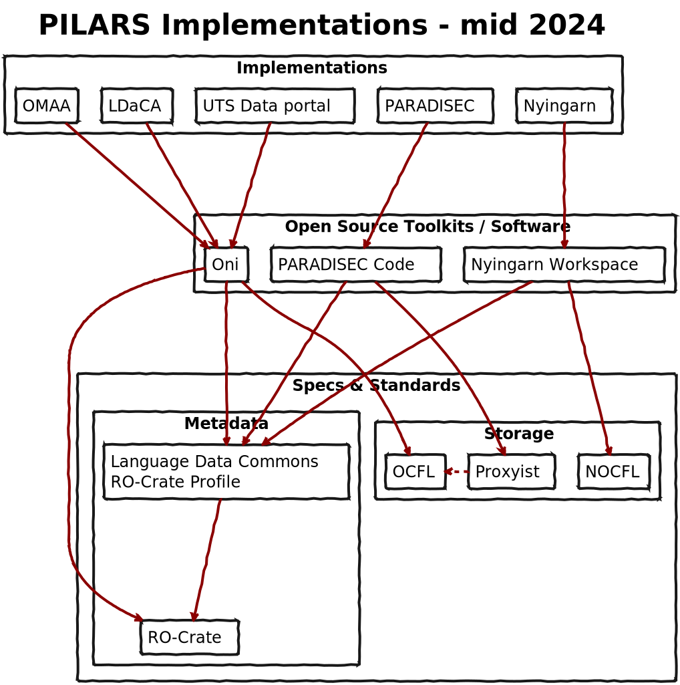

This page has summaries and links of known implementations of [the PILARS].

There are three software toolkits that implement the Protocols at least in part.

All of these implementations use RO-Crate metadata for the [PILARS] [Protocol 2].

1. The [Oni] platform, which uses the [Oxford Common File Layout] as a storage layer 

2. [Nyingarn Workspace] which uses [NOCFL] - a storage library which is mostly PILARS compliant but which does not (as far as we know) comply with [Protocol 1.3] -- as IDs do not translate directly to storage locations, unlike in PARADISEC.

3. [PARADISEC Archive Code], which uses [PROXYIST], wrapper for [OCFL] and a simpler file-like layout using object storage (S3).
    PARADISEC uses the [Nabu] system to manage its archive. This comprises an SQL database to store metadata and a storage layer to store the archive items. The storage layer is abstracted by [Proxyist], which provides a simple REST API in an object store-like fashion. Proxyist supports multiple backend storage mechanisms via a plugin mechanism. It can support combinations of local disk or S3 storage and supports plain directory storage or OCFL mechanisms. In the case of PARADISEC, Proxyist is being used to interface to an AWS S3 bucket with a simple file structure layout. The root of the bucket contains one directory for each collection in the repository. Each collection directory contains one directory for each item in the collection. The item directories contain all the essences of the item. This typically comprises archival and presentation versions of media like images, audio and video, and non-media items like PDF, ELAN, XLSX, etc. Alongside these files, a metadata file describing the item is stored. This is currently a custom XML file but will soon be replaced by an ROCrate JSON file.

This diagram shows the relationship between various implementations, the software toolkits they use and the specifications on which they are based.

{}

