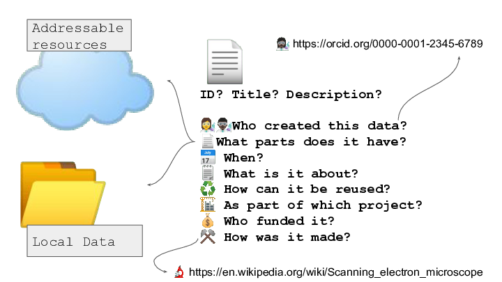
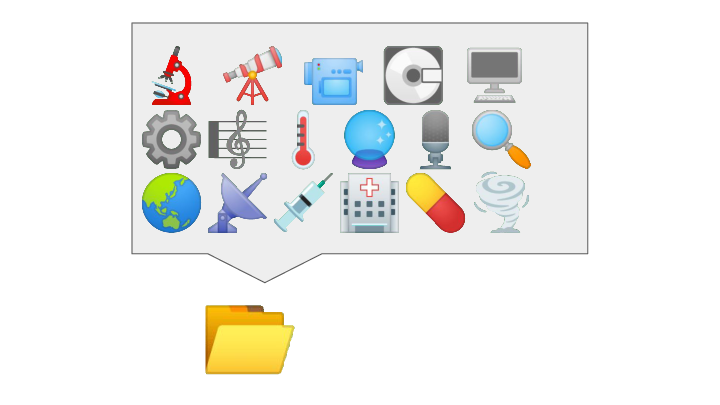
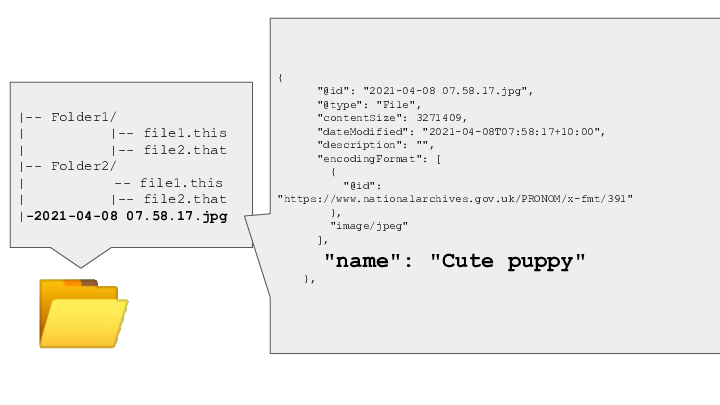
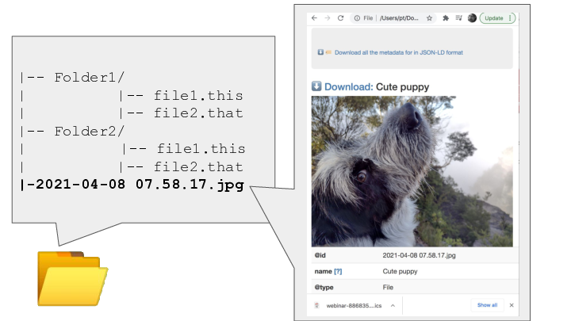
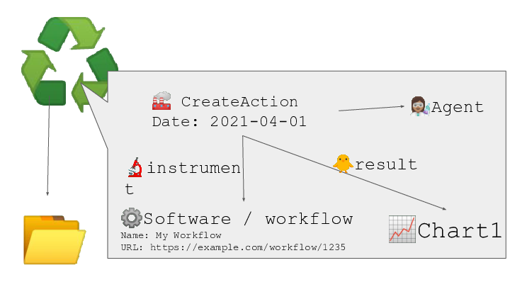
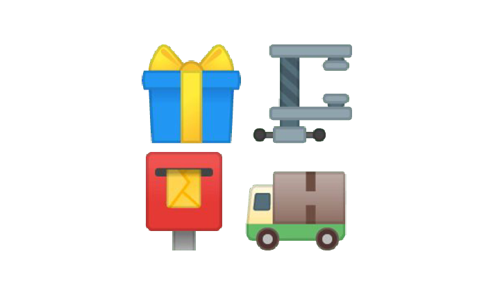

[RO-Crate](https://researchobject.github.io/ro-crate/) is a method for describing and packaging research data from ANY discipline into distributable, reusable *Digital Objects* with any amount of detailed metadata from simple who/what/where discovery-oriented description to metadata at the file-level or even variable level inside files.

RO-Crate is an implementer-focussed guide to best practice and is based on widely-used standards with [schema.org](https://schema.org) annotations in [JSON-LD](https://json-ld.org/) and aims to make it easy to creat good quality metadata description tools which are accessible and practical for use in a wide variety of situations; from an individual researcher working with a folder of data, to large data-intensive computational research environments.

RO-Crate is used in the [UTS Research Data Portal](/case-studies/uts-repo) and the [Modern PARADISEC demonstrator](/case-studies/paradisec) for all data objects.

RO-Crate is method for describing a dataset as a digital object using a **single linked-data metadata document**

Each resource can have a machine readable description in JSON-LD format

A human-readable description and preview can be in an HTML file that lives alongside the metadata

Provenance and workflow information can be included - to assist in data and research-process re-use

RO-Crate Digital Objects may be packaged for distribution eg via Zip, Bagit and OCFL Objects

